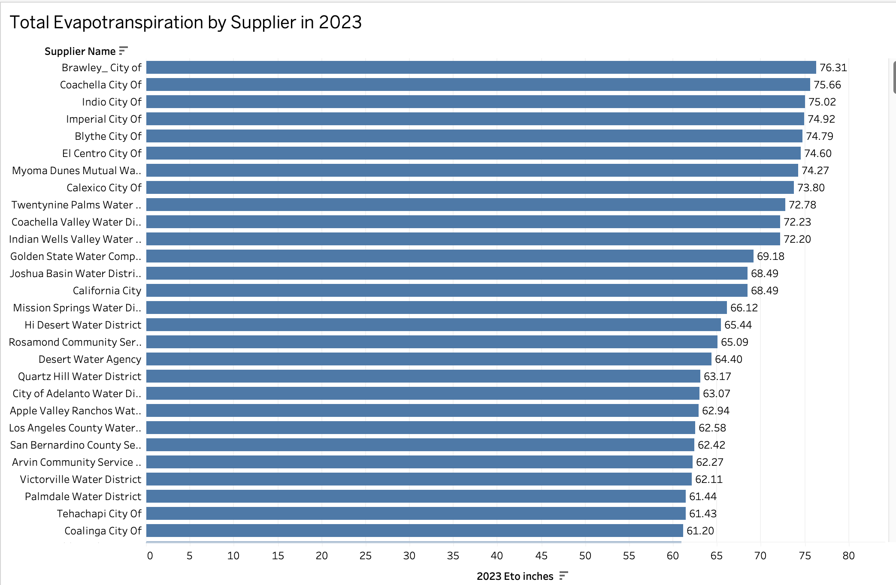
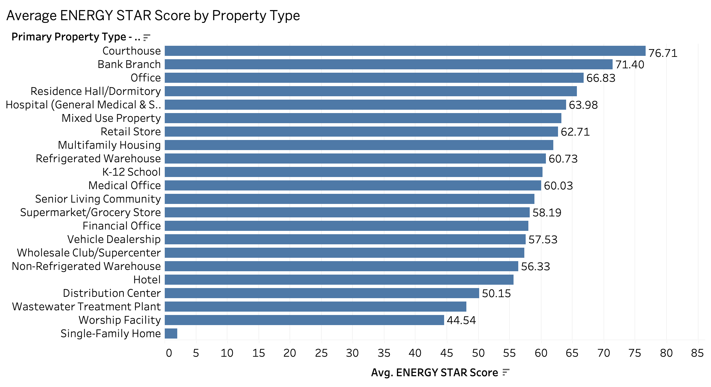
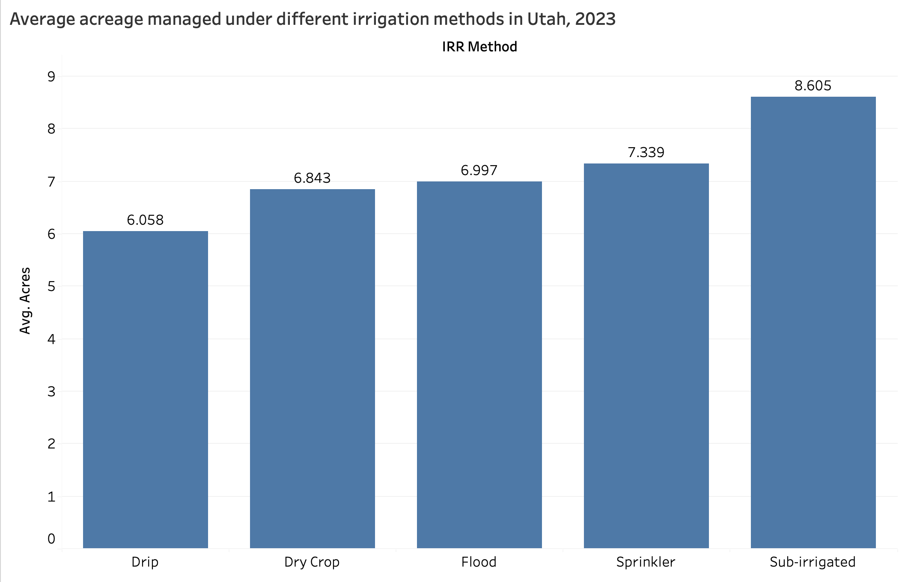

# 💧 Water Resource Exploration in Arid and Urban Regions

This repository contains Tableau visualisations and a project report from a data exploration study on sustainable water resource usage across **California**, **Utah**, and **New York City**. The focus is on understanding regional water efficiency and sustainability through visual storytelling.

---

## 📌 Introduction

This project explores how regions with different environmental conditions manage water sustainability. We use interactive dashboards to analyse:

- Agricultural irrigation practices in **Utah**
- Water supplier efficiency metrics in **California**
- Urban building sustainability in **New York City**

Each dashboard highlights specific water-use challenges and visual insights that can help drive informed decision-making.

---

## 🌱 Motivation

Water is a vital but limited resource. In both arid agricultural zones and dense urban settings, sustainability practices vary widely. By visualising real-world data:

- Stakeholders can compare regional performance
- Policymakers can identify effective conservation strategies
- The public gains transparency into local water usage

---

## 📊 Key Visualisations

| Region        | Dashboard File         | Focus Area                                       |
|---------------|------------------------|--------------------------------------------------|
| **Utah**      | `Landuse.twb`          | Irrigated acreage by **basin** and **method**   |
| **California**| `Fiscalyear.twb`       | Supplier metrics: **Evapotranspiration (Eto)** and **Effective Precipitation** |
| **NYC**       | `NYC_buiding_law.twb`  | ENERGY STAR Scores by **building type** and **borough** |

All dashboards are built in Tableau and allow users to filter by attributes, explore spatial patterns, and view sustainability metrics.

### 1. California – Total Evapotranspiration by Supplier

This bar chart shows the **total reference evapotranspiration (ETo)** in inches for California water suppliers in 2023. Higher ETo values indicate greater atmospheric water demand, critical for managing irrigation and water supply in arid zones like Imperial and Coachella Valleys.

---

### 2. NYC – ENERGY STAR Score by Property Type

This visual ranks **building types in NYC by average ENERGY STAR score**, a measure of energy efficiency. Courthouses, banks, and office buildings perform best, while worship facilities and single-family homes lag behind, suggesting areas for retrofitting and policy improvement.

---

### 3. Utah – Average Acreage by Irrigation Method

This chart compares the **average acreage managed using different irrigation methods** in Utah. Sub-irrigation and sprinkler systems manage the largest areas, while drip irrigation is used on smaller plots, highlighting trade-offs between efficiency and scale.

---

## 🔍 Insights

- **California** needs precise water planning in areas with high ETo.
- **Utah's** irrigation methods show variation in land use that can inform efficiency strategies.
- **NYC** buildings demonstrate a wide range of energy performance, with potential gains in residential sectors.

---

## 📁 Files in This Repository

- 📊 `Fiscalyear.twb` – Tableau dashboard for California supplier data  
- 🌾 `Landuse.twb` – Tableau dashboard for Utah irrigation data  
- 🏙️ `NYC_buiding_law.twb` – Tableau dashboard for New York City buildings  
- 📄 `Water_resource_exploration_project.pdf` – Final project report with discussion and reflections  

---

## ▶️ How to View Dashboards

1. Download the `.twb` files.
2. Open them using **Tableau Desktop** or **Tableau Public**.
3. Interact with the dashboards using dropdowns and tooltips.
4. Refer to the report (`.pdf`) for context, interpretation, and project rationale.

> 💡 Tableau Public is free and supports `.twb` files if Tableau Desktop is unavailable.

---

## 🛠️ Tools & Data Sources

- **Tools Used**: Tableau, Excel  
- **Datasets**:
  - *Utah Water Related Land Use (2023)*
  - *California Fiscal Year Supplier Report (2024)*
  - *NYC Building Energy Benchmarking Data (2023)*

---

## 📘 License

This project was completed for educational purposes. All datasets used are publicly available. Attribution is provided where required.

---

